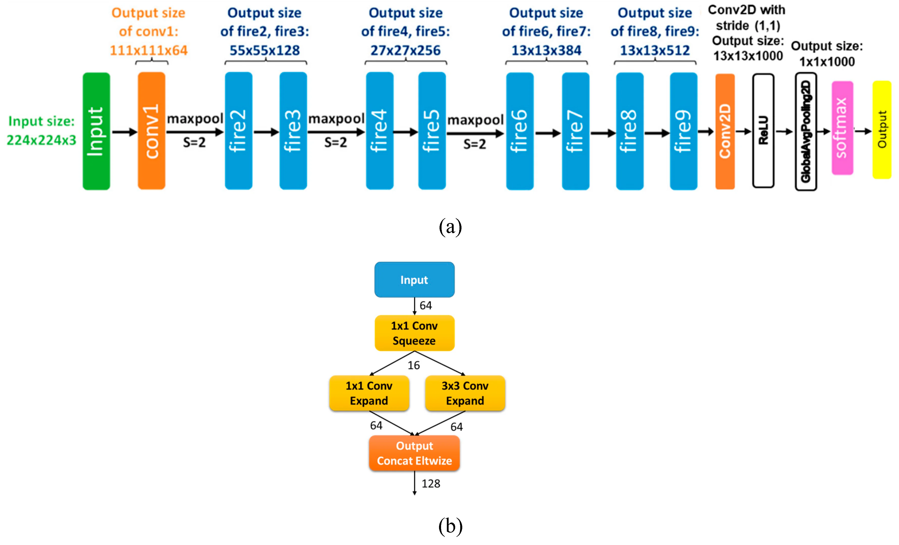
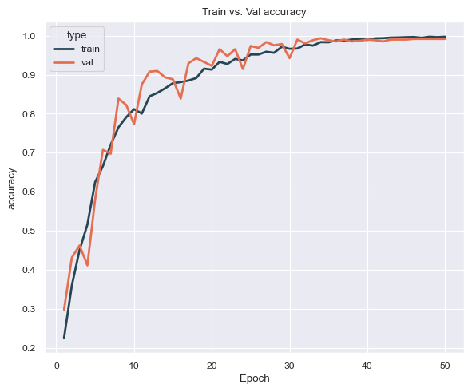
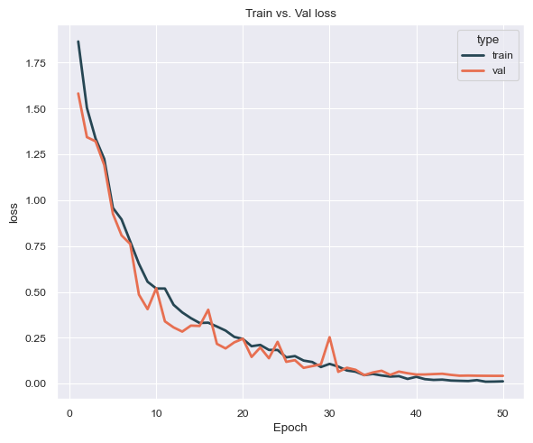

# Mango Leaf Disease Classification using SqueezeNet

## Project Overview

This project focuses on automatic recognition of mango leaf diseases using a deep learning approach. The goal is to classify images of mango leaves into healthy or diseased categories based on visual symptoms present on the leaf surface.

The model used in this project is **SqueezeNet**, a lightweight convolutional neural network architecture, trained **from scratch** on a dataset of mango leaf images. The project was developed as an **academic / machine learning course project**, with emphasis on model understanding, training pipeline design, and evaluation.

---

## Problem Statement

Plant diseases significantly affect agricultural productivity. Early and accurate identification of leaf diseases can help farmers take preventive actions and reduce crop losses.

This project addresses the problem of **image-based disease classification** for mango leaves using convolutional neural networks.

---

## Dataset

This project uses the **Mango Leaf Disease Dataset**, publicly available on Kaggle:

https://www.kaggle.com/datasets/warcoder/mango-leaf-disease-dataset

The dataset contains RGB images of mango leaves collected from real orchards and is designed for image-based plant disease classification tasks.

### Dataset Overview

- Total images: **4000**
- Image format: **JPG**
- Image resolution: **240 × 320**
- Number of classes: **8**
- Images per class: **500** (balanced dataset)

The dataset supports both binary classification (healthy vs. diseased) and multi-class disease classification.

### Classes

The dataset includes the following classes:

1. Healthy
2. Anthracnose
3. Bacterial Canker
4. Cutting Weevil
5. Die Back
6. Gall Midge
7. Powdery Mildew
8. Sooty Mould

### Notes on Data Collection

- Images were captured using mobile cameras in mango orchards.
- Part of the dataset consists of augmented images (rotations and zooms) to increase variability.
- The dataset represents common mango leaf diseases observed in real agricultural conditions.

---

## Model Architecture

The model architecture is based on **SqueezeNet**, which is designed to achieve AlexNet-level accuracy with significantly fewer parameters.

a) SqueezeNet architecture b) FireBlock architecture

Key characteristics:
- Fire modules (squeeze + expand layers)
- Small model size
- Efficient memory usage

In this project:
- The network was **trained from scratch** (no pre-trained weights)
- Final classification layer was adapted to the number of dataset classes

---

## Training Procedure

- Framework: **PyTorch**
- Loss function: Cross-Entropy Loss
- Optimizer: Adam
- Input size: resized RGB images
- Training performed on GPU

Standard data augmentation techniques were applied to improve generalization.

---

## Results and Evaluation

The trained model was evaluated on a prepared evaluation set. But the plots also include values measured during training process

- Accuracy plot

- Loss Plot

---

## How to Run